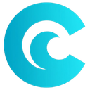
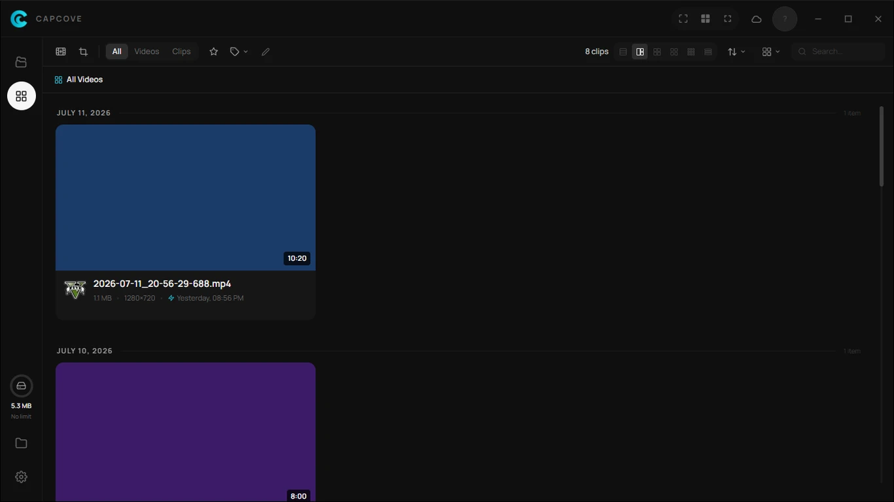
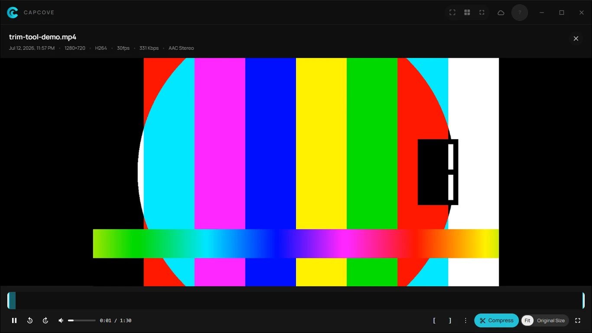
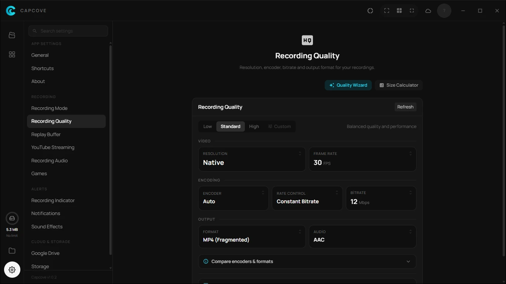
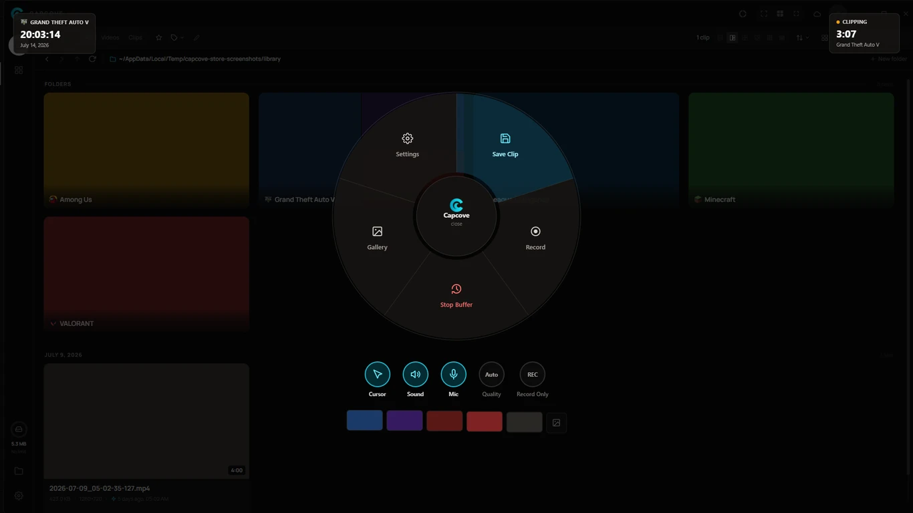
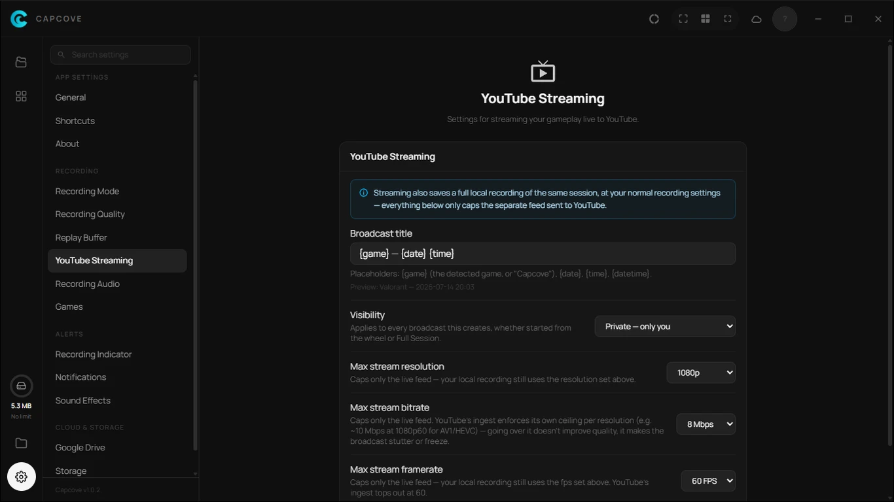

<div align="center">
  
  <h1>Capcove</h1>
  <p>Screen &amp; game recorder with Instant Replay, YouTube live streaming, and automatic Google Drive sync, built with Tauri 2 + React</p>

  [](LICENSE)
  [](https://github.com/xacnio/capcove/releases)
  [](https://xacnio.github.io/capcove/)

  <a href="https://apps.microsoft.com/detail/9NXZDV6V9HRX?launch=true&mode=full" target="_blank">
    
  </a>
</div>

---

Capcove lives in your system tray. Record a window, a monitor, or a dragged area with a shortcut or the on-screen wheel, keep a rolling Instant Replay buffer running in the background, and stream straight to YouTube — recordings sync to Google Drive on their own, and a built-in editor lets you trim clips before sharing them.

## Screenshots

<div align="center">
  
</div>

<details>
<summary><b>✨ Click here to view more screenshots</b></summary>
<br>

| Editor | Recording Settings |
| :---: | :---: |
|  |  |

| Instant Replay | YouTube Live |
| :---: | :---: |
|  |  |

</details>

## Features

> Windows only today (10/11, x64 + ARM64). macOS and Linux aren't supported.

**🎬 Recording**
- Record a window, the full monitor, or a dragged area — plus a one-click "record current session" for whatever game is running
- Hardware encoders: NVIDIA NVENC, AMD AMF, and Intel QSV (H.264 / HEVC / AV1), with software x264/x265/SVT-AV1/AOM AV1 fallbacks — `Auto` picks the best one available on your machine
- MP4, MKV, MOV, and crash-safe fragmented MP4/MOV containers
- Configurable resolution cap (never upscales), FPS, and bitrate
- Freeze, branded card, black frame, or full pause when the recorded window is minimized

**⏪ Instant Replay**
- Always-on rolling buffer (disk segments or an in-RAM ring) — save the last few minutes on demand with no re-encode
- Runs automatically whenever a detected game is in the foreground, independent of the always-on desktop buffer

**🎮 Game Detection**
- Recognizes games automatically from a built-in catalog (backed by Discord's public game-detection data) and reacts per your setting: start Instant Replay, start a full session recording, or do nothing
- Per-game overrides for encoder, resolution, bitrate, container, audio codec, YouTube Live, and default recording folder

**🎙️ Audio**
- Capture system output, microphone, and per-application audio (e.g. isolate just the game or just Discord) as independent sources
- Separate output tracks per source, or a single weighted mixdown, with a dedicated "Game" track and mix-priority control
- AAC, Opus, MP3, or lossless FLAC

**📺 YouTube Live**
- An alternative to local recording: instead of encoding to a file on disk, the session is streamed live to YouTube as a private, unlisted, or public broadcast, with its own resolution/bitrate/fps caps
- Once the stream ends, YouTube turns it into a regular video on its own — so nothing takes up local storage, and you still get a normal, shareable recording
- Customizable stream title template with `{game}`, `{date}`, and `{time}` tokens

**✂️ Built-in Editor**
- Trim and multi-cut clips without shifting the timeline, with independent per-track volume envelopes for each audio track
- Export locally or upload the result straight to YouTube

**☁️ Cloud Sync**
- Automatic background sync to a dedicated Google Drive folder — already-uploaded files are tracked and never re-sent, and the upload queue survives a restart
- Full / Local-priority / Manual sync modes, with pause/resume
- No backend — Capcove talks to Drive directly from your machine. OAuth tokens are stored in Windows Credential Manager and never sent anywhere else

**🖼️ Gallery**
- Unified view of local and Drive-synced recordings, grouped by game and by folder
- Tags, favorites, and per-folder rules (auto-delete after N days, always keep, never upload)
- Crash recovery: recovers or repairs footage left behind by an unclean shutdown, for both full recordings and the Instant Replay buffer

**🎛️ Wheel & Shortcuts**
- Radial shortcut wheel for every capture action, with an on-screen "currently playing" context card
- Fully customizable hotkeys, elevated/admin mode support, and a lightweight on-screen HUD showing recording/buffer/mic status

**🌍 Internationalization**
- English and Türkçe, fully localized interface

**💻 Platform Integration**
- Lives in the system tray, with optional autostart
- Built-in auto-updater
- Local storage limit with automatic cleanup of the oldest recordings

## Install

Grab the latest build from [Releases](https://github.com/xacnio/capcove/releases). Pick the badge that matches your machine — **x64** is the regular Intel/AMD build, **ARM64** is for ARM-based PCs.

**🪟 Windows (10+)**

[](https://github.com/xacnio/capcove/releases/latest)

[](https://github.com/xacnio/capcove/releases/latest)

Or get it from the Microsoft Store:

<a href="https://apps.microsoft.com/detail/9NXZDV6V9HRX?launch=true&mode=full" target="_blank">
  
</a>

## Build from source

```bash
git clone https://github.com/xacnio/capcove
cd capcove
npm install
```

ffmpeg/ffprobe aren't committed to the repo (~137MB each, over GitHub's
100MB per-file push limit) — CI fetches a pinned [BtbN/FFmpeg-Builds](https://github.com/BtbN/FFmpeg-Builds)
release instead (see `.github/workflows/release.yml`), and building locally
needs the same one-time step:

```powershell
.\scripts\fetch-ffmpeg.ps1          # or -Arch arm64
```

It downloads the same pinned build CI uses into `src-tauri/binaries/`,
verifying it against the hashes in `src-tauri/src/integrity.rs` along the
way — the app hash-checks these again at runtime and refuses to run them if
they don't match, so update both places together if you ever swap builds.

```bash
npm run tauri dev    # development
npm run tauri build  # installer package (NSIS/MSI)
```

Requires [Rust](https://rustup.rs/), [Node.js](https://nodejs.org/), and platform-specific deps for Tauri — see [Tauri prerequisites](https://v2.tauri.app/start/prerequisites/).

## Using your own Google Cloud OAuth client (optional)

Capcove connects to Google Drive out of the box using its own built-in OAuth
client — just click **Connect Google account** in Settings and you're done.
Setting up your own Client ID is only useful if you'd rather run on your own
Google Cloud quota instead of the shared default one. If that doesn't matter
to you, skip this section entirely.

1. [Google Cloud Console](https://console.cloud.google.com/) → create a new project (e.g. "Capcove").
2. **APIs & Services → Library** → find **Google Drive API** and click **Enable**.
3. **APIs & Services → OAuth consent screen**:
   - User type: **External** → Create
   - Fill in the app name and email fields, then save.
   - Add your own Gmail address under **Audience → Test users** (unless you publish the app to "production", only test users can sign in — that's enough for personal use).
4. **APIs & Services → Credentials → Create Credentials → OAuth client ID**:
   - Application type: **Desktop app**
   - Copy both the generated **Client ID** and **Client Secret**.
5. In Capcove's Settings window (tray icon → Settings → Advanced), paste **both** the Client ID and Client Secret → click **Connect Google account** → grant access on the Google page that opens in your browser.

> **The Client Secret field is required once you supply your own Client ID.**
> If you leave it empty, Capcove falls back to its own built-in secret, which
> won't match your custom Client ID and Google will reject the connection
> with `invalid_client` / "The provided client secret is invalid". Fix: copy
> the Client ID and Secret together from the same OAuth client (`GOCSPX-...`)
> and paste both in.
>
> Your tokens are stored only on your own machine, in your OS credential store (see **Cloud Sync** above).

## Where are my files?

| What | Windows |
|---|---|
| Recordings | `%USERPROFILE%\Videos\Capcove` |
| Settings | `%APPDATA%\dev.xacnio.capcove\settings.json` |
| Upload record | `%APPDATA%\dev.xacnio.capcove\uploaded.json` |
| Pending upload queue | `%APPDATA%\dev.xacnio.capcove\pending_uploads.json` |
| Video metadata (titles, tags, favorites) | same base path as Settings, `metadata.json` + `tags.json` |
| Drive / YouTube tokens | Windows Credential Manager |

The recordings folder is configurable in Settings.

Installed via the Microsoft Store (MSIX)? Windows redirects `%APPDATA%` to a
per-package virtualized path instead — look under
`%LOCALAPPDATA%\Packages\<PackageFamilyName>\LocalCache\Roaming\dev.xacnio.capcove\`.

## How it works

- Hit a shortcut or open the wheel (default `Alt+F2`) to record a window, the monitor under your cursor, or a dragged area — or let Capcove start Instant Replay or a full session automatically when it recognizes a game.
- An on-screen HUD shows recording/buffer/mic status while it's running; save a clip from the live Instant Replay buffer at any time with no re-encode.
- Finished recordings land in your recordings folder and are queued for Google Drive upload automatically (unless Manual sync mode is on).
- Open a recording in the built-in editor to trim it, adjust per-track audio volume, and export or upload straight to YouTube.
- The gallery keeps a unified view of local and Drive-synced footage, organized by game and by folder, with tags and favorites.

## Disclaimer

Capcove integrates with third-party services — Google Drive and YouTube for cloud sync and live streaming, and Discord's public game-detection data for the game catalog used by Game Detection. It is not affiliated with or endorsed by any of them. You're responsible for the content you upload or stream through these services and for complying with their terms of use.

## Built with

| Project | Description | License |
| :--- | :--- | :--- |
| [Tauri](https://tauri.app) | Lightweight desktop app framework | MIT / Apache-2.0 |
| [React](https://react.dev) | UI library | MIT |
| [Tailwind CSS](https://tailwindcss.com) | Utility-first CSS framework | MIT |
| [Vite](https://vitejs.dev) | Frontend build tool | MIT |
| [react-icons](https://react-icons.github.io/react-icons) | Icon components | MIT |
| [TanStack Virtual](https://tanstack.com/virtual) | Virtualized lists/grids | MIT |
| [marked](https://marked.js.org) | Markdown rendering (update/changelog dialogs) | MIT |
| [Manrope](https://manropefont.com) | UI font | OFL-1.1 |
| [Tokio](https://tokio.rs) | Async runtime | MIT |
| [reqwest](https://github.com/seanmonstar/reqwest) | HTTP client | MIT / Apache-2.0 |
| [windows-rs](https://github.com/microsoft/windows-rs) | Win32 API bindings | MIT / Apache-2.0 |
| [windows-capture](https://github.com/NiiightmareXD/windows-capture) | Windows Graphics Capture bindings | MIT |
| [xcap](https://github.com/nashaofu/xcap) | Cross-platform screen capture (picker overlay) | MIT |
| [image-rs](https://github.com/image-rs/image) | Image encoding/decoding | MIT / Apache-2.0 |
| [serde](https://serde.rs) / [serde_json](https://github.com/serde-rs/json) | Serialization framework | MIT / Apache-2.0 |
| [notify](https://github.com/notify-rs/notify) | Filesystem watcher (recordings folder) | MIT / Apache-2.0 |
| [chrono](https://github.com/chronotope/chrono) | Date/time handling | MIT / Apache-2.0 |
| [keyring-rs](https://github.com/open-source-cooperative/keyring-rs) | Cross-platform OS credential store access | MIT |
| [zeroize](https://github.com/RustCrypto/utils/tree/master/zeroize) | Wipes OAuth tokens from memory when no longer needed | MIT / Apache-2.0 |
| [trash](https://github.com/Byron/trash-rs) | Sends deleted recordings to the Recycle Bin instead of erasing them | MIT / Apache-2.0 |
| [FFmpeg](https://ffmpeg.org) ([BtbN builds](https://github.com/BtbN/FFmpeg-Builds)) | Bundled encoder/muxer binary for recording, replay, and editing | GPL-3.0 (binary only — see [LICENSE](LICENSE)) |

## AI Disclosure

This project was developed with the assistance of AI-powered coding tools (Claude and similar LLM-based agents) to speed up the path to a first stable release. All generated code was reviewed and guided by the developer's own software engineering judgment throughout.

Going forward, maintenance, stability improvements, and new features will be driven primarily through conventional development practices, with AI tools used only as supplementary aids where appropriate.

## License

[MIT](LICENSE)

## Privacy Policy

[Privacy Policy](PRIVACY.md) · [Terms of Service](TERMS.md)

Also published on the website: [Privacy](https://xacnio.github.io/capcove/privacy.html) · [Terms](https://xacnio.github.io/capcove/terms.html) · [License](https://xacnio.github.io/capcove/license.html)
